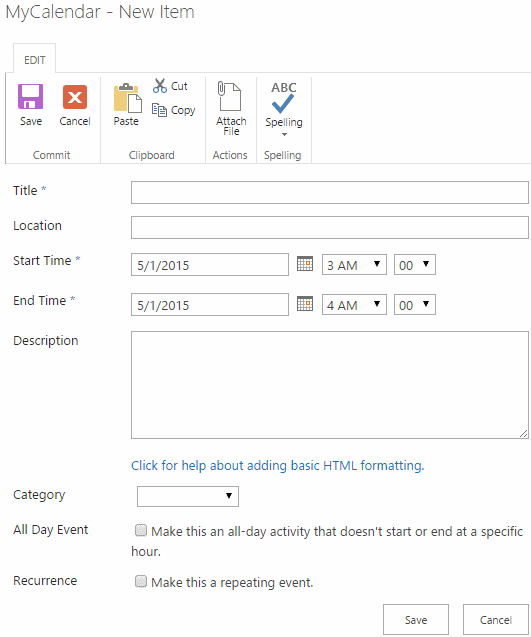
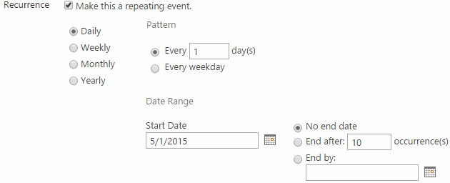
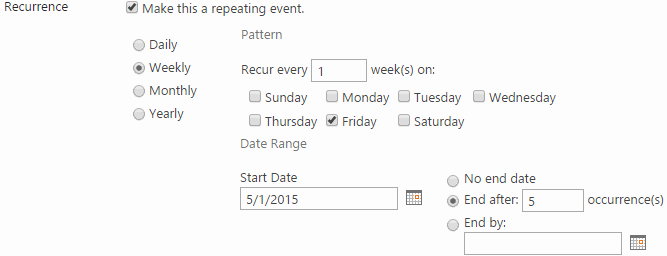
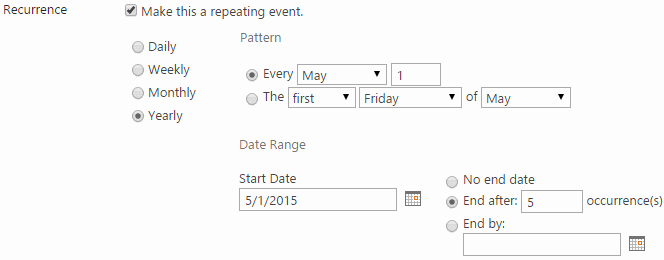

# CalendarWare recurrence expander

You're the co-founder and backend developer at CalendarWare, Inc., a
Roskilde-based startup specializing in next generation calendar
solutions. Among the company's innovative, future products are plugins for
Umbraco, Drupal, and SharePoint, adding calendars with advanced
appointment recurrence features. 

In the near future, the recurrence expander backend underlying the 
plugins is also to be integrated into custom project planning 
software and payment systems to generate project and payment schedules. 
In all cases, advanced date arithmetic is required, including the ability 
to handle recurrence exceptions for such dates as holidays and vacations.

These offerings are typically composed of a frontend and a backend
part. The frontend varies greatly with each content management,
project planning, or payment scheduling system. As luck would have it,
your co-founder is a skilled frontend developer who implements her
part using the latest fad in frontend technologies. But for the 
backend, your skills are needed to provide the frontend with 
actual dates to display.

In close cooperation, the two of you have agreed on the frontend and
backed requirements for the first prototype. As you've adopted the 
latest and greatest in agile methodologies, lengthy requirement 
documents are a thing of the past. Instead, you mostly work from 
screenshots and examples and iron out uncertainties as you go.

While your partner develops the frontend, your job is to develop the
backend based on these screenshots, examples, and below requirements:

  - For the backend to be easily consumed by various frontends, it
    must be implemented using open communication standards and capable
    of receiving requests and returning responses in JSON and XML
    formats. Specifically, the backend must be an ASP.NET WebAPI
    service.

  - Provided with a recurring appointment, the web service must expand
    it into a series of appointments such that they satisfy the 
	recurrence pattern provided by the frontend. 

  - The backend must only use classes provided by Microsoft as
    part of the .NET framework or ASP.NET. No third-party
	date expansion code is allowed. It could potentially infringe on 
	another party's copyright.

  - Focus on making the code as human-readable as possible through
    good naming of classes, methods, variables, and so forth. The code
    should also be nicely separated into classes and method so as to
    avoid code duplication and further human communication and readability.

  - To ensure the backend works reliably, it must be accompanied with
    automated integration tests exercising the public API of the web 
	service and hence its various recurrence expansions. The Integration 
	tests must accompany the web service and simulate a client calling it.

  - In developing the application, where applicable, make use of
    proper language constructs and libraries covered in the
    course. Don't try to shoehorn each and every construct into the
    application, but evaluate each against your intended design and
    pick the one you decide is right.

  - To communicate key design decisions to your co-founder, future self, 
    and potential investors, you must create and maintain a document of 
	no more than four pages. It should be an experience report 
	highlighting key design decisions such as patterns and algorithms
    used, trade-offs and an example of the web service request and
    response for an expansion.

  - It's encouraged, though not a strict functional requirement, that 
    you keep source code under version control using Github. Doing so
	enhances team collaboration and makes development easier when
	you want to undo code changes and revert to a known state.

## Deadlines

Source code and documentation must be provided to your co-founder and
two tech-savvy potential investors no later than June 7, 2015 at 11.59pm 
or CalendarWare, Inc. risks bankruptcy.

On June 16, 2015, your co-founder and you are to pitch
your backend to the two potential investors. Unfortunately, your 
partner is down with the flu and you alone must prepare a presentation
and time it for about 13 minutes. Make sure to include key points from last 
week's experience report -- investors are busy people so assume only one 
has read it -- and a demo of the web service in action. 
Following your presentation, you and the potential investors will discuss 
your backend in particular and backend topics in general.

## Screenshots and examples

To better understand backend requirements, the screenshots and prose below
are accompanied by examples of recurrence patterns and their expanded forms. For 
each example, it's assumed the recurring appointments starts on May 1, 2015 and
repeats for five occurrences.

### Single, non-recurring appointments

After you navigate to the calendar in one of the content management systems 
and select New appointment, the following dialog box appears. It enables you to 
create a simple non-recurring appointment:

The Category dropdown consists of the following options:

  - Meeting
  - Holiday
  - Birthday
  - Anniversary

Think of the options as a way of tagging appointments. In the frontend, appointments 
can then be filtered on those. The exact options aren't all too important.

### Daily recurring appointments

When you click the "Make this a repeating event" option, the dialog box changes and
a recurrence pattern selector appears. Also, Start date and End date 
from the empty appointment are replaced by Start time
and End time because the actual dates are inferred from the recurrence
pattern:

Examples: 

Daily, every 3 days: 5/1/2015, 5/2/2015, 5/3/2015, 5/4/2015, 5/5/2015  
Daily, every weekday: 5/1/2015, 5/4/2015, 5/5/2015, 5/6/2015, 5/7/2015

## Weekly recurring appointments

Examples: 

Weekly, every 3 weeks on Mon, Wed, Fri: 5/1/2015, 5/18/2015, 5/20/2015, 5/22/2015, 6/8/2015

### Monthly recurring appointments

The "first" dropdown contains options

  - first
  - second
  - third
  - fourth
  - last

The "day" dropdown contains options

  - weekday
  - weekend day
  - Sunday
  - Monday
  - Tuesday
  - Wednesday
  - Thursday
  - Friday
  - Saturday

Examples:

Monthly, every day 5 of every 3 months: 5/5/2015, 8/5/2015, 11/5/2015, 2/5/2016, 5/5/2016  
Monthly, third weekend day of 1 month: 5/9/2015, 6/13/2015, 7/11/2015, 8/8/2015, 9/12/2015  
Monthly, last Friday of every 3 months: 5/29/2015, 8/28/2015, 11/27/2015, 2/26/2016, 5/27/2016

### Yearly recurring appointments

As for the dropdowns, "first" and "day" contain the options listed under Monthly. The
"January" dropdown contains all 12 months.

Examples:

Yearly, every May 5: 5/5/2015, 5/5/2016, 5/5/2017, 5/5/2018, 5/5/2019  
Yearly, the fourth weekday of April: 4/6/2016, 4/6/2017, 4/5/2018, 4/4/2019, 4/6/2020

