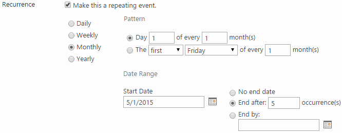

# CalendarWare recurrence expander

You're the co-founder and backend developer at CalendarWare, Inc., a
Roskilde-based startup specializing in next generation calendar
solutions. Among the company's innovative, future products are plugins
for Umbraco, Drupal, and SharePoint, adding calendars with advanced
appointment recurrence features akin to Google Calendar.

In the near future, the plan is to expand and integrate the calendar
plugins with custom project planning software and payment systems to
generate project and payment schedules. In each case, advanced date
arithmetic is required, including the ability to handle recurrence
exceptions for such dates as holidays and vacations.

The plugins are typically composed of a frontend and a backend
part. The frontend varies greatly with each content management,
project planning, or payment scheduling system. As luck would have it,
your co-founder is a skilled frontend developer, fluent in the latest
frontend technologies. But for designing and developing the backend,
your skills are required to turn the recurrence patterns into an
appointment series to display in the frontend.

In close cooperation, the two of you have agreed on the frontend and
backend requirements for the initial prototype. As you've adopted the
latest and greatest in agile methodologies, lengthy requirement
documents are a thing of the past. Instead, you work from screenshots
and example patterns and address unclear or missing requirements as
you go.

Based on these screenshots and example patterns, your partner has
started developing the frontend. Your job is to develop the backend,
taking into account the additional requirements below:

  - At a minimum, the backend must support daily and weekly recurring
    appointments within a start date and end date range. The *No end
    date* and *End after n occurrence(s)* aren't required for the
    minimum implementation.

  - For the backend to be easily consumed by various frontends, it
    must be implemented using open communication standards and capable
    of receiving requests and returning responses in JSON and XML
    formats. Specifically, the backend must be an ASP.NET WebAPI
    service.

  - Provided with a recurrence pattern, serialized as JSON or XML by
    the frontend and deserialized into an object by ASP.NET WebAPI,
    the web service must expand the pattern into a series of dates.

  - To ensure the backend works correctly and reliably -- and keeps
    doing so -- it must be accompanied by automated tests. These
    should exercise the public API of the web service, simulating a
    client calling it. Tests may be implemented using either the xUnit
    testing framework or a console application.

  - The backend must only use classes which are part of the core .NET
    framework or ASP.NET. No third-party date expansion code is
    allowed. It could potentially infringe on another company's
    copyright or patents.

  - In developing the web service and tests, make use of the
    object-oriented language and library constructs covered in the
    course. Don't try to shoehorn each and every construct into the
    design and implementation, but evaluate alternatives against the
    intended outcome and pick ones that meets your needs.

  - Focus on making the code as human-readable as possible through
    good naming of classes, methods, variables, and so forth. The code
    should be nicely separated into classes and methods so as to avoid
    code duplication and further human communication and readability.

  - To communicate key design decisions to your co-founder, future
    self, and potential investors, you must create and maintain a
    document of no more than four pages. Think of it as an experience
    report emphasizing the "why" of key design decisions, algorithms
    used and their trade-offs. In addition, include an example of the
    web service's XML and JSON request and response for a recurrence
    pattern of your choosing.

  - It's encouraged, though not a strict requirement, that you keep
    source code under version control using Github. Doing so enhances
    team collaboration and makes it easier for you to undo changes and
    revert to a known state.

## Deadlines

Source code and documentation must be provided to your co-founder and
two tech-savvy potential investors no later than June 7, 2015 at
11.59pm or CalendarWare, Inc. risks bankruptcy.

On June 16, 2015, your partner and you are to pitch your backend to
two potential investors. Unfortunately, your partner has come down
with the flu and you alone must prepare a 13 minutes
presentation. Make sure to include key points from the experience
report and a demo of the web service in action (investors are busy
people so assume only one has read the report). Following the
presentation, you and the potential investors will discuss your
backend in particular and backend topics in general.

## Screenshots and examples

To better understand the backend requirements, the screenshots and
prose below are accompanied by examples of recurrence patterns and
their expanded forms. For each example, it's assumed the recurrence
pattern starts on May 1, 2015 and repeats for five occurrences.

Given a pattern, the frontend expects the backend to return its
expanded form. With these dates in hand, the frontend clones the
recurrence appointment, not including the recurrence part. In its
place goes each start date and end date returned by the backend, in
effect turning the recurring appointment into a series of single,
non-recurring appointments.

### Single, non-recurring appointment

After you navigate to the future calendar in one of the content
management systems and select *New appointment*, the following
dialog box appears. It enables you to create a single,
non-recurring appointment:

The Category dropdown consists of the following options:

  - Meeting
  - Holiday
  - Birthday
  - Anniversary

Think of the options as a way of tagging appointments. In the
frontend, appointments can then be filtered on those. The exact
options aren't all too important.

### Daily recurring appointment

When you click the *Make this a repeating event* option, the user
interface changes and the recurrence pattern selector
appears. Also, the Start and End date and time components from
the Single, non-recurring appointment above is replaced by Start
time and End time only. The actual dates are inferred from the
recurrence pattern:

Examples: 

Daily, every 3 days: 5/1/2015, 5/2/2015, 5/3/2015, 5/4/2015, 5/5/2015  
Daily, every weekday: 5/1/2015, 5/4/2015, 5/5/2015, 5/6/2015, 5/7/2015

### Weekly recurring appointment

Examples: 

Weekly, every 3 weeks on Mon, Wed, Fri: 5/1/2015, 5/18/2015, 5/20/2015, 5/22/2015, 6/8/2015

### Monthly recurring appointment

The *first* dropdown contains options

  - first
  - second
  - third
  - fourth
  - last

The *day* dropdown contains options

  - weekday
  - weekend day
  - Sunday
  - Monday
  - Tuesday
  - Wednesday
  - Thursday
  - Friday
  - Saturday

Examples:

Monthly, every day 5 of every 3 months: 5/5/2015, 8/5/2015, 11/5/2015, 2/5/2016, 5/5/2016  
Monthly, third weekend day of 1 month: 5/9/2015, 6/13/2015, 7/11/2015, 8/8/2015, 9/12/2015  
Monthly, last Friday of every 3 months: 5/29/2015, 8/28/2015, 11/27/2015, 2/26/2016, 5/27/2016

### Yearly recurring appointments

As for the dropdowns, *first* and *day* contain the options
listed under Monthly. The *January* dropdown contains all 12
months.

Examples:

Yearly, every May 5: 5/5/2015, 5/5/2016, 5/5/2017, 5/5/2018, 5/5/2019  
Yearly, the fourth weekday of April: 4/6/2016, 4/6/2017, 4/5/2018, 4/4/2019, 4/6/2020

### Recurrence exceptions

Whether or not the frontend or backend should handle recurrence
exceptions is up to you as the backend developer. The key idea,
though, is to have the ability to exclude one or more of the 
expanded dates. For instance, suppose an appointment represents 
a class every Friday, but due to national holidays some Fridays 
must be skipped. Each Friday being skipped is a recurrence exception 
to the pattern. In principle, either the frontend or backend or 
both could have this feature build in.

## Tips and tricks

### Setting up Visual Studio solution

To facilitate development and testing, it might be worth creating
an empty Visual Studio solution and adding the following projects 
to it. Notice the difference between the two types of testing 
projects. Pick either the xUnit or the console based approach to 
testing:

  - CalendarRecurrenceExpander (Solution)
    - CalendarRecurrenceExpander.Web (ASP.NET Web Application)
	  - For hosting ASP.NET WebAPI service.
	  - Based on Web API sub-template.
	  - Common convention is to manually add an Api folder
	    to hold WebAPI controllers.
    - CalendarRecurrenceExpander.Test (Class Library if testing with xUnit)
	  - Add xUnit support to project by referencing xunit and
        xunit.runner.visualstudio Nuget packages.
	  - For code to be able to call web service, reference the 
	    Newtonsoft.Json Nuget package and System.Net.Http local 
		assembly.
      - Make calls to the web service through the HttpClient class.
    - CalendarRecurrenceExpander.Console (Console Application if testing with regular console app)
	  - For code to be able to call web service, reference the 
	    Newtonsoft.Json Nuget package and System.Net.Http local 
		assembly.
      - Make calls to the web service through the HttpClient class.

### Separating business logic into controllers

In terms of the HTTP protocol, which ASP.NET WebAPI is an abstraction
on top of, each WebAPI controller represents a resource. One resource, and 
thus one WebAPI controller, may respond to HTTP verbs such as Get, 
Put, Post, and Delete through controller methods by the same names. 
In general, it isn't possible to add more than one of each kind of verb or 
method to the controller. Thus, when posting recurrence patterns to 
the web service, one controller is required for each recurrence pattern, 
resulting in controllers such as DailyEveryNthDayController and 
DailyEveryWeekdayController.